# RestaurantOS — User Stories & Flow Diagrams

## Agent Reference Document

| | |
|---|---|
| **Version** | 1.0 |
| **Purpose** | Complete implementation reference for AI coding agents |
| **Companion** | RestaurantERP_SaaS_Specification.md |

> **How to read this document:** User stories define *what* to build and *when it is done*. Flow diagrams define *how data moves* and *what logic runs*. Every story maps to at least one flow. Every flow maps to at least one service. Build in the order of Appendix E (Phases 1–5).

---

# Table of Contents

- US-0. Platform & SuperAdmin Stories
- US-1. Authentication & Session Stories
- US-2. POS & Order Management Stories
- US-3. Inventory Management Stories
- US-4. Financial System Stories
- US-5. Vendor & Supply Chain Stories
- US-6. Reporting & NLQ Stories
- US-7. HR & Payroll Stories
- US-8. CRM & Loyalty Stories
- US-9. Kitchen Display System Stories
- US-10. Multi-Branch & RBAC Stories
- US-11. Notification Stories
- US-12. Audit & Compliance Stories
- FD-1. Tenant Provisioning Flow
- FD-2. Authentication & Token Flow
- FD-3. POS Order Lifecycle State Machine
- FD-4. Order Close — Event Fan-Out Flow
- FD-5. Offline POS Sync Flow
- FD-6. Inventory Depletion Sequence
- FD-7. Moving Average Cost Update Flow
- FD-8. Purchase Order & Three-Way Match Flow
- FD-9. Financial Auto-Posting Decision Tree
- FD-10. NLQ Pipeline Flow
- FD-11. KDS Order Routing Flow
- FD-12. Inter-Branch Stock Transfer Flow
- FD-13. Payroll Run Flow
- FD-14. Period Close Flow
- FD-15. Feature Flag & Quota Enforcement Flow
- FD-16. White-Label Domain Provisioning Flow
- FD-17. OPA Authorization Decision Flow
- FD-18. Frontend Request Lifecycle Flow
- FD-19. RabbitMQ Event Backbone Flow
- FD-20. Notification Dispatch Flow

---

# US-0. Platform & SuperAdmin Stories

---

### US-0.1 — Provision a New Tenant
**As a** SuperAdmin,
**I want to** create a new tenant with a chosen subscription tier,
**so that** the restaurant owner can access the platform immediately with the right features.

**Acceptance Criteria:**
- AC1: Form accepts: company name, primary contact name, email, phone, country, timezone, tier (STARTER/GROWTH/ENTERPRISE).
- AC2: System generates a unique UUID `tenant_id` and a URL-safe `slug` (e.g., `lume-cafe`).
- AC3: Default feature flags for the chosen tier are automatically seeded into `tenant_features`.
- AC4: A Tenant Admin user is created in `auth_db` with a system-generated temporary password and status `MUST_CHANGE_PASSWORD`.
- AC5: A default branch (HQ) is created in `user_db.branches` linked to the tenant.
- AC6: A seed chart of accounts (Pakistan standard) is written to `finance_db.chart_of_accounts` for the tenant.
- AC7: A welcome email is dispatched via the Notification Service containing the login URL (`{slug}.restaurantos.io`) and temporary credentials.
- AC8: Tenant status is `PENDING_SETUP` until setup wizard is completed; then transitions to `ACTIVE`.
- AC9: Full provisioning completes in under 60 seconds.
- AC10: All provisioning steps are logged in `platform_db.impersonation_log` equivalent audit trail.

---

### US-0.2 — View All Tenants
**As a** SuperAdmin,
**I want to** see a paginated list of all tenants with their live status,
**so that** I can monitor the platform at a glance.

**Acceptance Criteria:**
- AC1: Table shows: tenant name, slug, tier, status badge, branch count, user count, last login date, monthly NLQ usage %.
- AC2: Filter by status (ACTIVE, SUSPENDED, CANCELLED), tier, country, date provisioned.
- AC3: Click tenant name navigates to the tenant detail page.
- AC4: Data refreshes every 60 seconds or on manual refresh.

---

### US-0.3 — Suspend and Reactivate a Tenant
**As a** SuperAdmin,
**I want to** suspend or reactivate a tenant,
**so that** I can act on payment failures or policy violations.

**Acceptance Criteria:**
- AC1: Suspend requires a mandatory reason (dropdown + free text).
- AC2: On suspend: tenant status → `SUSPENDED`; all active sessions for that tenant's users are invalidated immediately (refresh tokens purged from `auth_db`).
- AC3: All API calls from suspended tenant users return 403 `TENANT_SUSPENDED` with a support contact message.
- AC4: On reactivate: status → `ACTIVE`; users can log in again; quota counters are NOT reset.
- AC5: Suspension and reactivation events are logged in `platform_db` and published as `TENANT_SUSPENDED` / `TENANT_REACTIVATED` platform events.

---

### US-0.4 — Impersonate a Tenant Admin
**As a** SuperAdmin,
**I want to** temporarily act as a specific tenant's admin user,
**so that** I can troubleshoot issues without sharing credentials.

**Acceptance Criteria:**
- AC1: Impersonation requires a mandatory reason text before starting.
- AC2: A record is written to `platform_db.impersonation_log` with `platform_user_id`, `tenant_id`, `target_user_id`, `reason`, `started_at`.
- AC3: The impersonated session JWT contains `impersonated_by: <super_admin_id>`.
- AC4: Every action taken during impersonation writes `impersonated_by` to `audit_log`.
- AC5: Impersonated session expires after 30 minutes; non-renewable without re-authentication.
- AC6: The impersonated user's screen shows a visible red banner: "Session managed by platform support."
- AC7: On session end, `impersonation_log.ended_at` is set.

---

### US-0.5 — Manage Tenant Feature Flags
**As a** SuperAdmin,
**I want to** enable or disable specific feature flags for any tenant,
**so that** I can grant trial access, apply enterprise customisations, or restrict a degraded tier.

**Acceptance Criteria:**
- AC1: Feature flag UI shows all flags from Appendix C with current on/off state per tenant.
- AC2: Changes are effective within 5 minutes (Redis cache TTL for feature flags is 5 min; on manual change, the cache is invalidated immediately for that tenant).
- AC3: Enabling a flag that exceeds the tenant's tier (e.g., enabling `FEATURE_HR` on STARTER) shows a warning but is allowed (SuperAdmin override).
- AC4: All flag changes are logged with before/after state.

---

### US-0.6 — View Platform Telemetry
**As a** SuperAdmin,
**I want to** see a real-time dashboard of platform health,
**so that** I can identify service degradation before tenants report it.

**Acceptance Criteria:**
- AC1: Dashboard tiles: total active tenants, DAU (distinct logins today), total orders today across all tenants, API P95 latency, error rate %, NLQ calls today + estimated Anthropic cost (USD).
- AC2: Service health matrix: one row per microservice showing replica count, P95 latency, error rate, last deploy timestamp.
- AC3: RabbitMQ queue depth per queue displayed with alert threshold markers.
- AC4: Data sourced from Prometheus; refreshes every 30 seconds.

---

# US-1. Authentication & Session Stories

---

### US-1.1 — Log In with Email and Password
**As a** any user (Tenant or SuperAdmin),
**I want to** log in with my email and password,
**so that** I can access the system.

**Acceptance Criteria:**
- AC1: Login form accepts email, password, and (for tenant users) the tenant slug is resolved from the subdomain or custom domain automatically.
- AC2: On success: access JWT returned in response body; refresh token set as HttpOnly Secure SameSite=Strict cookie.
- AC3: JWT contains `tenant_id`, `branch_id` (first assigned branch), `roles`, `permissions[]`, `attributes{}`.
- AC4: If `totp_enabled = true` and no `totp_code` submitted: return 401 with code `TOTP_REQUIRED`. Front-end renders the TOTP input field.
- AC5: After 5 consecutive failures: account locked for 15 minutes; return 401 with `locked_until` timestamp.
- AC6: Locked account shows remaining lockout time on the login form.
- AC7: Successful login publishes `USER_LOGIN_SUCCEEDED` event → Audit Service.
- AC8: Login failure publishes `USER_LOGIN_FAILED` event → Audit Service.

---

### US-1.2 — Enable Two-Factor Authentication
**As a** any user,
**I want to** enable TOTP-based 2FA on my account,
**so that** my account is protected even if my password is compromised.

**Acceptance Criteria:**
- AC1: Initiating 2FA setup: server generates a TOTP secret, returns a QR code data URI for scanning with an authenticator app.
- AC2: User submits a verification code; server confirms validity before persisting `totp_secret` (AES-256-GCM encrypted) and setting `totp_enabled = true`.
- AC3: 8 single-use backup codes are generated, shown once, and stored as bcrypt hashes in `user_backup_codes`.
- AC4: 2FA is mandatory for users with `rbac.manage` or `finance.period.close` permissions. System blocks granting these permissions to users without 2FA enabled.
- AC5: Disabling 2FA requires a valid TOTP code or a backup code.

---

### US-1.3 — Switch Active Branch
**As a** multi-branch user,
**I want to** switch which branch I am operating in,
**so that** all data I see and create belongs to the correct branch.

**Acceptance Criteria:**
- AC1: Branch switcher dropdown appears only if the user has access to more than one branch.
- AC2: Selecting a branch calls `POST /api/v1/auth/switch-branch` with `{ branchId }`.
- AC3: Server validates the user has at least one active role at the requested branch.
- AC4: Server issues a new JWT with `branch_id` updated and `permissions[]` recomputed for the new branch's roles.
- AC5: Front-end replaces the stored JWT and invalidates all TanStack Query caches (full cache reset).
- AC6: The UI re-renders with the new branch's data within 2 seconds.
- AC7: The active branch name is permanently visible in the top navigation bar.

---

### US-1.4 — Reset Forgotten Password
**As a** any user,
**I want to** reset my password via email,
**so that** I can regain access if I forget it.

**Acceptance Criteria:**
- AC1: "Forgot password" sends a single-use reset link to the user's email. Link expires in 30 minutes.
- AC2: Clicking the link presents a form to set a new password (with confirmation).
- AC3: New password is validated against policy (10+ chars, 3 of 4 complexity rules, not in last 5 passwords, not in common-passwords list).
- AC4: On success: all existing refresh sessions for the user are revoked; user is redirected to login.
- AC5: If 2FA is enabled, resetting password also requires a TOTP code.

---

### US-1.5 — Complete Tenant Setup Wizard (First Login)
**As a** new Tenant Admin (first login),
**I want to** be guided through initial setup,
**so that** the system is configured for my business before I use it.

**Acceptance Criteria:**
- AC1: Wizard is shown automatically on first login if tenant status is `PENDING_SETUP`.
- AC2: Steps in order: (1) Set new password, (2) Upload logo and set brand colours, (3) Name the first branch and set its timezone, (4) Confirm currency and fiscal year start month, (5) Optionally add a second branch.
- AC3: Wizard can be saved partially and resumed on re-login.
- AC4: On wizard completion: tenant status transitions from `PENDING_SETUP` to `ACTIVE`.
- AC5: User is redirected to the main dashboard after completion.
- AC6: If wizard is abandoned for more than 7 days, SuperAdmin receives a notification.

---

# US-2. POS & Order Management Stories

---

### US-2.1 — Open a Till Session
**As a** Cashier,
**I want to** open my till session with a declared opening float,
**so that** all orders I take are attributed to my shift.

**Acceptance Criteria:**
- AC1: Cashier enters the opening cash float amount in PKR.
- AC2: System creates a `till_sessions` record with `status = OPEN`, `opening_float_paisa`, `opened_at`, `cashier_id`, `branch_id`.
- AC3: Only one open till session per cashier at a time. Attempting a second returns an error: "You already have an open till session."
- AC4: Till session ID is attached to all orders created in this session.
- AC5: Event `TILL_OPENED` published → Audit Service.

---

### US-2.2 — Create a Dine-In Order
**As a** Cashier,
**I want to** create a new dine-in order for a table,
**so that** the kitchen knows what to prepare.

**Acceptance Criteria:**
- AC1: Cashier selects table from the floor plan (only AVAILABLE tables shown).
- AC2: Table status changes to `OCCUPIED` immediately on order creation.
- AC3: Order is created with status `OPEN`, type `DINE_IN`, linked to the selected table, the cashier's `till_session_id`.
- AC4: Cashier can add menu items: tap category → tap item → set quantity → optionally choose modifiers → add to order.
- AC5: Menu items not available at this branch (via `branch_menu_overrides.is_available = false`) are hidden.
- AC6: Effective price = `COALESCE(branch_override.price_paisa, menu_item.base_price_paisa)`.
- AC7: Tax is calculated per line: `line_total_paisa * tax_rate_pct / 100`, rounded half-up to nearest paisa.
- AC8: Order totals update in real time as items are added.
- AC9: A client-generated UUID is sent as `client_order_id` for offline deduplication.
- AC10: Order creation publishes `ORDER_CREATED` event → Kitchen Service, Audit Service.

---

### US-2.3 — Send Order to Kitchen
**As a** Cashier,
**I want to** send a confirmed order to the kitchen,
**so that** chefs know to start preparing.

**Acceptance Criteria:**
- AC1: "Send to Kitchen" button is only enabled when the order has at least one item and status is `OPEN`.
- AC2: Order status transitions to `SENT_TO_KDS`.
- AC3: Each order item is routed to its designated KDS station based on `menu_item.kds_station` tag.
- AC4: `order.sent_to_kds_at` is recorded.
- AC5: Event `ORDER_SENT_TO_KDS` published → Kitchen Service with `{ orderId, branchId, items: [{itemId, name, qty, kdsStation, notes}] }`.
- AC6: KDS screens update in real time (via WebSocket) within 2 seconds.

---

### US-2.4 — Apply a Discount
**As a** Cashier,
**I want to** apply a discount to a line item or the whole order,
**so that** I can honour promotions or resolve complaints.

**Acceptance Criteria:**
- AC1: Line-level discount: flat PKR amount or percentage.
- AC2: Order-level discount: flat PKR amount or percentage applied after subtotal.
- AC3: Discounts up to 10% on any single line: any cashier with `pos.order.discount.line` permission.
- AC4: Discounts over 10% on a line, or any order-level percentage discount: requires `pos.order.discount.override` permission (Branch Manager or above). OPA policy enforced server-side.
- AC5: Discount amount is validated: cannot exceed line total (cannot make line negative).
- AC6: All applied discounts are stored in `order_discounts` linked to the order.
- AC7: Tax is recalculated after discount: `(unit_price - discount_per_unit) * qty * tax_rate`.

---

### US-2.5 — Close an Order with Payment
**As a** Cashier,
**I want to** close an order and record the payment method(s),
**so that** revenue is captured and the table is freed.

**Acceptance Criteria:**
- AC1: Payment screen shows: order total, "amount tendered" field, change calculation (for cash).
- AC2: Multiple payment methods allowed on one order (split-tender). Sum of all payments must equal `order.total_paisa`. Validation prevents closing if they do not match.
- AC3: Supported methods: CASH, CARD, LOYALTY_POINTS, BANK_TRANSFER, VOUCHER.
- AC4: On close: order status → `CLOSED`; `closed_at` recorded; table status → `AVAILABLE`.
- AC5: Event `ORDER_CLOSED` published with full payload (items, payments, totals).
- AC6: Finance Service listener auto-posts revenue JE and COGS JE.
- AC7: Inventory Service listener depletes ingredients per recipe.
- AC8: CRM Service listener credits loyalty points (if customer is associated).
- AC9: Reporting Service listener writes to `sales_facts` in ClickHouse.
- AC10: Receipt is generated (printable and/or digital) after close.
- AC11: `Idempotency-Key` header is mandatory on the close request; duplicate close returns the original response without re-posting JEs.

---

### US-2.6 — Split Bill
**As a** Cashier,
**I want to** split the bill equally or by item,
**so that** multiple diners can pay separately.

**Acceptance Criteria:**
- AC1: **Equal split**: Enter number of ways (2–20). System divides `total_paisa` by N. Remainder paisa added to the first share (not distributed — avoids rounding loops).
- AC2: **By item**: Cashier assigns each order item to a diner (1–N). System calculates per-diner totals including proportional tax and service charge.
- AC3: Each split portion becomes a separate `order_payments` entry under the same order.
- AC4: The order is not closed until all portions are collected.
- AC5: Partial split payment is allowed; remaining balance shown clearly.

---

### US-2.7 — Void an Open Order
**As a** Cashier or Branch Manager,
**I want to** void an order that has not been closed,
**so that** mistakes are corrected without financial impact.

**Acceptance Criteria:**
- AC1: Void is only available on orders with status `OPEN` or `SENT_TO_KDS`.
- AC2: Cashier can void their own OPEN orders (OPA: `pos.order.void.own`, `resource.created_by == user.id`, `resource.status == OPEN`).
- AC3: Branch Manager can void any OPEN order at their branch (`pos.order.void.any`).
- AC4: Void requires a mandatory reason (dropdown + free text).
- AC5: On void: order status → `VOIDED`; table status → `AVAILABLE`; KDS tickets for this order cancelled.
- AC6: No financial posting is generated for a voided order.
- AC7: Event `ORDER_VOIDED` published → Audit Service.

---

### US-2.8 — Refund a Closed Order
**As a** Branch Manager,
**I want to** process a full or partial refund on a closed order,
**so that** the customer is compensated and the GL is corrected.

**Acceptance Criteria:**
- AC1: Refund is only available on orders with status `CLOSED`.
- AC2: Requires `pos.order.refund` permission (Branch Manager or above).
- AC3: Partial refund: select which items to refund. Full refund: all items.
- AC4: Refund method must be specified (CASH, CARD_REVERSAL). Defaults to original payment method.
- AC5: On refund: order status → `REFUNDED` (full) or remains `CLOSED` with a linked refund record (partial).
- AC6: Event `ORDER_REFUNDED` published → Finance Service, Inventory Service, Audit Service.
- AC7: Finance Service reverses the revenue JE and COGS JE proportionally.
- AC8: Inventory Service reinstates ingredient stock proportionally.

---

### US-2.9 — Operate POS Offline
**As a** Cashier,
**I want to** continue taking and closing orders even when the server is unreachable,
**so that** service is not interrupted during network outages.

**Acceptance Criteria:**
- AC1: Service Worker intercepts all `/api/v1/pos/*` requests when offline.
- AC2: Mutating requests (create order, add item, close order, record payment) are queued in IndexedDB.
- AC3: Order IDs generated client-side (UUID v4); stored as `client_order_id`.
- AC4: UI shows a yellow "Offline mode — X orders queued" banner.
- AC5: On reconnect: queued mutations are flushed oldest-first. Each carries its `client_order_id` as `Idempotency-Key`.
- AC6: Server deduplicates on `orders.client_order_id` unique constraint. Duplicate submission returns the existing order — no double-post.
- AC7: Menu and prices are served from Service Worker cache (last-good version).
- AC8: Sync completion banner shown: "X orders synced successfully."
- AC9: If a sync item fails (e.g., order was voided server-side while offline): error shown per order with option to review.

---

### US-2.10 — Close Till Session
**As a** Cashier,
**I want to** close my till session at the end of my shift,
**so that** my cash is counted and any variance is recorded.

**Acceptance Criteria:**
- AC1: Close till shows: expected closing balance (opening float + cash sales - cash refunds), a field to declare actual cash in drawer.
- AC2: Variance = declared - expected. Stored in `till_sessions.variance_paisa`.
- AC3: Variance is displayed in PKR with colour: green (0), amber (within threshold), red (exceeds threshold).
- AC4: Till close is blocked if there are open (non-closed, non-voided) orders in this session.
- AC5: On close: `till_sessions.status = CLOSED`, `closed_at` recorded.
- AC6: If variance exceeds the branch-configured threshold: notification sent to Branch Manager.
- AC7: Event `TILL_CLOSED` published → Finance Service (for shift reconciliation JE), Audit Service.
- AC8: `Idempotency-Key` mandatory on till close.

---

# US-3. Inventory Management Stories

---

### US-3.1 — Create an Ingredient
**As an** Inventory Manager,
**I want to** add an ingredient to the master list,
**so that** it can be used in recipes and tracked in stock.

**Acceptance Criteria:**
- AC1: Fields: name, base unit of measure (from UOM table), reorder point (in base units), expiry tracking toggle, initial stock quantity per branch (optional).
- AC2: Ingredient is tenant-scoped; visible across all branches.
- AC3: If initial stock is provided per branch: an `inventory_movements` row of type `OPENING_BALANCE` is created for each branch.
- AC4: Duplicate ingredient name (same tenant) is rejected with a clear error.

---

### US-3.2 — Create a Recipe
**As an** Inventory Manager or Chef,
**I want to** define the recipe (BOM) for a menu item,
**so that** ingredients are automatically depleted on every sale.

**Acceptance Criteria:**
- AC1: A recipe is linked to one `menu_item_id` (cross-service reference — stored as a UUID, no FK).
- AC2: Each recipe line: ingredient (from ingredient master), quantity, unit of measure (must be in same UOM family as ingredient's base unit or convertible), yield percentage (0.01–1.00).
- AC3: Yield defaults to 1.00 (no loss). Example: 0.85 means 15% trim loss — system will deduct `qty / 0.85` in base units.
- AC4: `yield_servings` on the recipe header: how many menu item portions this recipe produces (default 1).
- AC5: Saving creates a new recipe version (`version` incremented). Previous version's `is_current` is set to false.
- AC6: Effective depletion per portion per ingredient: `(line.qty * uom.to_base_factor / line.yield_pct) / recipe.yield_servings`.
- AC7: A menu item with no recipe attached: depletion is skipped (no error), a warning is logged.

---

### US-3.3 — Receive Stock Against a Purchase Order
**As an** Inventory Manager,
**I want to** record a goods receipt for delivered items,
**so that** stock levels increase and the GR/IR clearing account is credited.

**Acceptance Criteria:**
- AC1: Select an APPROVED or SENT purchase order. Only APPROVED/SENT POs can be received.
- AC2: For each line: enter quantity actually received (can be less than or equal to PO quantity — partial delivery allowed).
- AC3: On save: `ingredient_branch_stock.qty_on_hand` is incremented by received base qty.
- AC4: Moving average cost (MAC) is recalculated: `new_avg = ((current_qty * current_avg) + (received_qty * unit_cost)) / (current_qty + received_qty)`.
- AC5: An `inventory_movements` row of type `PURCHASE` is created.
- AC6: Event `STOCK_RECEIVED` published → Finance Service (for GR/IR JE: DR Inventory / CR GR/IR Clearing).
- AC7: PO status updates: if all lines fully received → `FULLY_RECEIVED`; else → `PARTIALLY_RECEIVED`.

---

### US-3.4 — Record Wastage
**As an** Inventory Manager or Chef,
**I want to** record wasted ingredients,
**so that** stock levels are accurate and wastage is tracked as an expense.

**Acceptance Criteria:**
- AC1: Select ingredient, branch, quantity wasted (in any valid UOM for the ingredient), reason (dropdown: SPOILAGE, COOKING_ACCIDENT, EXPIRY, THEFT, OTHER), optional notes.
- AC2: `ingredient_branch_stock.qty_on_hand` decremented by the wastage base quantity.
- AC3: Wastage cost = `qty_wasted_base * current_avg_cost_paisa`.
- AC4: `inventory_movements` row of type `WASTAGE` created.
- AC5: Event published → Finance Service: DR Wastage Expense (5200) / CR Inventory (1300) at MAC.
- AC6: Wastage is visible in the Wastage Summary report.

---

### US-3.5 — Perform a Physical Stock Count
**As an** Inventory Manager,
**I want to** count physical stock and record it in the system,
**so that** book stock and actual stock are reconciled.

**Acceptance Criteria:**
- AC1: Create a count sheet for a branch: system populates all active ingredients with current `qty_on_hand` as system qty.
- AC2: Count status: DRAFT → IN_PROGRESS → PENDING_APPROVAL → APPROVED → POSTED.
- AC3: Counter enters `counted_qty` per ingredient.
- AC4: `variance_qty = counted_qty - system_qty`. Displayed with colour (green = zero, amber = small, red = large).
- AC5: PENDING_APPROVAL state sends a notification to Branch Manager / OWNER.
- AC6: On APPROVED → POSTED: for each line with non-zero variance:
  - Update `ingredient_branch_stock.qty_on_hand` to `counted_qty`.
  - Create `inventory_movements` of type `COUNT_VARIANCE`.
  - Publish event → Finance Service: if variance < 0: DR Stock Count Loss / CR Inventory; if variance > 0: DR Inventory / CR Stock Count Gain.
- AC7: Posting is atomic — all lines succeed or all roll back.
- AC8: `Idempotency-Key` on the POST action prevents double-posting.

---

### US-3.6 — View Low Stock Alerts
**As an** Inventory Manager,
**I want to** see a list of ingredients below their reorder point,
**so that** I can raise purchase orders before running out.

**Acceptance Criteria:**
- AC1: Alert list shows: ingredient name, current qty, base unit, reorder point, % of reorder point remaining, days-to-zero (based on 7-day average depletion rate).
- AC2: Sorted by days-to-zero ascending (most urgent first).
- AC3: A "Create PO" quick-action button pre-fills a purchase order with that ingredient.
- AC4: Alert is also sent as a notification (in-app + email if configured) when `qty_on_hand` first crosses below `reorder_point`.

---

# US-4. Financial System Stories

---

### US-4.1 — View the Chart of Accounts
**As an** Accountant or Owner,
**I want to** view and manage the chart of accounts,
**so that** GL postings use the correct account structure.

**Acceptance Criteria:**
- AC1: Hierarchical tree view: 1xxx Assets, 2xxx Liabilities, 3xxx Equity, 4xxx Revenue, 5xxx COGS, 6xxx–7xxx Expenses.
- AC2: System accounts (tagged with `system_tag`) cannot be deleted and cannot be renumbered.
- AC3: Adding a new account: code, name, type, parent code. Code must be unique within the tenant.
- AC4: Deactivating an account is only allowed if it has zero balance in all open periods.

---

### US-4.2 — Post a Manual Journal Entry
**As an** Accountant,
**I want to** post a manual journal entry,
**so that** corrections, accruals, and non-auto-posted transactions are recorded.

**Acceptance Criteria:**
- AC1: Form: entry date (must be within an OPEN period), description, one or more debit lines, one or more credit lines.
- AC2: Save is blocked if total debits ≠ total credits (balance validation both client-side and server-side).
- AC3: On save: JE is marked as `source_type = MANUAL`, `posted_by = current_user_id`.
- AC4: JE is immutable after posting. Corrections are made via reversal (creates a new counter-entry).
- AC5: Reversal button available on any JE. Creates a new JE with all debits/credits swapped and `is_reversal = true`.
- AC6: Event `JOURNAL_POSTED` published → Audit Service.
- AC7: OPA enforces: user must have `finance.journal.post` AND the entry date's period must be OPEN.

---

### US-4.3 — Record a Business Expense
**As a** Branch Manager or Accountant,
**I want to** record a business expense (e.g., electricity bill),
**so that** it is reflected in the P&L.

**Acceptance Criteria:**
- AC1: Fields: expense category (GL account from 6xxx range), amount (PKR), payment method (CASH or ACCRUED), vendor (optional), description, date, receipt upload (optional, stored in MinIO via File Service).
- AC2: CASH payment: DR Expense Account / CR Cash on Hand (1010).
- AC3: ACCRUED: DR Expense Account / CR Accrued Expenses (2500). A separate AP entry created if vendor is specified.
- AC4: OPA approval check: if amount > `user.attributes.approval_limit_paisa` → requires approval from a higher-limit role.
- AC5: Finance Service auto-posts the JE on save (or on approval for amounts requiring it).
- AC6: Receipt file is linked to the expense record via `file_id`.

---

### US-4.4 — Perform Bank Reconciliation
**As an** Accountant,
**I want to** reconcile the bank statement against GL cash entries,
**so that** discrepancies are identified and explained.

**Acceptance Criteria:**
- AC1: Accountant selects a bank account (from COA, tagged `BANK`) and imports a statement (CSV upload).
- AC2: System matches statement transactions to GL journal lines by: date ±2 days, amount exact match, or reference number match.
- AC3: Matched items are highlighted green. Unmatched GL entries and unmatched statement lines are highlighted amber.
- AC4: Accountant can manually match or mark unmatched items as: timing difference, bank charge, error.
- AC5: Reconciliation is saved as a record in `bank_reconciliations`. Status: DRAFT, COMPLETE.
- AC6: Closing balance on statement must equal GL balance for reconciliation to be marked COMPLETE.

---

### US-4.5 — Execute Period Close
**As an** Accountant or Owner,
**I want to** close an accounting period,
**so that** no further postings can alter that period's financials.

**Acceptance Criteria:**
- AC1: Pre-close checks (all must pass before close is allowed):
  - No open orders (status `OPEN` or `SENT_TO_KDS`) older than 12 hours.
  - No purchase orders in `PARTIALLY_RECEIVED` state with an unbooked vendor invoice.
  - No vendor invoices in `PENDING_MATCH` state older than 48 hours.
  - All bank reconciliations for the period marked COMPLETE.
- AC2: If any check fails: show the list of blocking items with links to resolve them.
- AC3: On close: period status → `LOCKED`. All JE creation for that period is blocked.
- AC4: A "Close Period" confirmation dialog shows the period summary (total debits, credits, net income).
- AC5: Event `PERIOD_CLOSED` published → Audit Service, Reporting Service (triggers P&L snapshot in ClickHouse).
- AC6: Reopening a locked period requires `finance.period.reopen` permission (OWNER only). Reopen logs a reason and audit event.

---

# US-5. Vendor & Supply Chain Stories

---

### US-5.1 — Create a Vendor
**As an** Inventory Manager or Accountant,
**I want to** add a vendor to the system,
**so that** I can raise purchase orders and book invoices against them.

**Acceptance Criteria:**
- AC1: Required fields: name, contact person, phone, payment terms (NET15/NET30/NET45/COD), NTN (optional), STRN (optional).
- AC2: Optional: email, address, bank account number (encrypted at rest), notes.
- AC3: Duplicate vendor name (same tenant) shows a warning but is allowed (same vendor, different branch or category).
- AC4: Vendor is tenant-scoped; visible across branches.

---

### US-5.2 — Create and Submit a Purchase Order
**As an** Inventory Manager,
**I want to** create a purchase order and submit it for approval,
**so that** the purchasing process is controlled and documented.

**Acceptance Criteria:**
- AC1: PO header: vendor (from vendor master), branch (delivery destination), expected delivery date, notes.
- AC2: PO lines: ingredient (from ingredient master), quantity, unit of measure, agreed unit price (paisa). Price is pre-filled from `vendor_catalogues` if a catalogue entry exists.
- AC3: PO total = sum of (qty × unit_price) per line.
- AC4: On submit: status → `PENDING_APPROVAL`. Approval routing is determined by total amount vs tier thresholds (configurable).
- AC5: Approval notification sent to the required approver(s).
- AC6: PO can be edited while in DRAFT. Once PENDING_APPROVAL, editing requires withdrawal (→ DRAFT).

---

### US-5.3 — Approve or Reject a Purchase Order
**As a** Branch Manager or Owner,
**I want to** approve or reject a purchase order,
**so that** spending is controlled.

**Acceptance Criteria:**
- AC1: Approver sees: vendor, all PO lines, total, requester name, submission date.
- AC2: OPA approval policy: `expense.amount <= user.attributes.approval_limit_paisa`. If the PO total exceeds the approver's limit, they cannot approve and must escalate.
- AC3: Approve: status → `APPROVED`. Requester notified. PO can now be sent to vendor and used for GRN.
- AC4: Reject: requires a reason. Status → `REJECTED`. Requester notified. PO can be revised (→ DRAFT) and resubmitted.
- AC5: Multi-tier: if PO requires two approvers (Tier 2), first approver's action records as Tier 1 approved; status stays `PENDING_APPROVAL` until second approver acts.

---

### US-5.4 — Book a Vendor Invoice and Run Three-Way Match
**As an** Accountant,
**I want to** book a vendor invoice and verify it against the PO and GRN,
**so that** I only pay what was ordered and received.

**Acceptance Criteria:**
- AC1: Select vendor, enter invoice number, invoice date, due date.
- AC2: For each invoice line: select matching PO line (auto-suggested based on vendor + outstanding PO lines), enter invoiced qty and unit price.
- AC3: On save: three-way match runs automatically comparing invoice vs PO vs GRN.
- AC4: Match result displayed per line: OK (green), QTY_UNDER/OVER (amber), PRICE_UNDER/OVER (amber or red).
- AC5: If all lines OK: invoice status → `MATCHED`. Finance Service auto-posts: DR GR/IR Clearing / CR AP.
- AC6: If any line fails: status → `MISMATCHED`. Invoice is blocked from payment.
- AC7: Override: requires `vendor.invoice.override_match` permission (ACCOUNTANT or OWNER). Override requires mandatory justification text. Audited.
- AC8: After override: invoice proceeds to `APPROVED_FOR_PAYMENT`.

---

### US-5.5 — Process a Vendor Payment
**As an** Accountant,
**I want to** record payment to a vendor,
**so that** the AP balance is cleared and the bank balance is reduced.

**Acceptance Criteria:**
- AC1: Select one or more APPROVED_FOR_PAYMENT invoices from the same vendor.
- AC2: Payment method: Bank Transfer (select bank account from COA), Cash.
- AC3: Payment amount can be partial; remaining AP balance stays on the invoice.
- AC4: On save: Finance Service auto-posts: DR AP (2100) / CR Bank (1100) for the payment amount.
- AC5: Invoice status → `PAID` (fully) or `PARTIALLY_PAID`.
- AC6: Event `AP_PAYMENT_PROCESSED` published → Audit Service.
- AC7: `Idempotency-Key` mandatory on payment.

---

# US-6. Reporting & NLQ Stories

---

### US-6.1 — View the Live Dashboard
**As an** Owner or Branch Manager,
**I want to** see real-time KPIs on my dashboard,
**so that** I can monitor today's performance at a glance.

**Acceptance Criteria:**
- AC1: Dashboard tiles refresh via WebSocket push within 5 seconds of a relevant event (order close, till close).
- AC2: Default tiles for OWNER: Revenue Today, Revenue This Month vs Last Month, Top 5 Items by Revenue, Gross Margin %, Active Orders, Low Stock Alert Count.
- AC3: OWNER with multi-branch access sees a branch selector; "All Branches" option shows consolidated metrics.
- AC4: Each tile is clickable and navigates to the corresponding detailed report.
- AC5: Dashboard layout is customisable per user (drag-to-reorder, show/hide tiles).

---

### US-6.2 — Run a Sales by Day Report
**As an** Owner or Branch Manager,
**I want to** run a Sales by Day report for a date range,
**so that** I can see daily revenue trends.

**Acceptance Criteria:**
- AC1: Parameters: date from, date to, branch (or all branches for OWNER with consolidated permission).
- AC2: Output: one row per business day — date, order count, cover count, gross revenue, discounts, tax, net revenue, COGS, gross margin, gross margin %.
- AC3: Totals row at the bottom.
- AC4: Chart: dual-axis line chart (revenue + order count) over the date range.
- AC5: Query executes against ClickHouse `sales_facts` table. P95 < 3 seconds for up to 12 months of data.
- AC6: Export to PDF and Excel available.

---

### US-6.3 — Ask a Natural Language Question
**As an** Owner or Branch Manager,
**I want to** type a business question in plain language and receive an answer,
**so that** I can get ad-hoc insights without waiting for a developer to build a report.

**Acceptance Criteria:**
- AC1: Input field with placeholder "Ask anything about your restaurant…" and 3 quick-access suggestion chips.
- AC2: Loading state shown while the NLQ pipeline runs (max visible wait: 7 seconds for P95).
- AC3: Answer displayed as: (a) text narrative paragraph, (b) data table, (c) chart if applicable.
- AC4: If the NLQ service returns a refusal: show the refusal reason and suggest rephrasing.
- AC5: "Copy SQL" toggle shows the generated SQL (collapsed by default, for power users).
- AC6: Last 20 questions shown in a history sidebar with ability to re-run.
- AC7: When tenant's monthly NLQ quota reaches 80%: a warning banner shown. At 100%: input disabled with upgrade CTA.
- AC8: A user with `nlq.use` permission revoked: input is hidden entirely.

---

### US-6.4 — Schedule a Report via Email
**As an** Owner,
**I want to** schedule a report to be emailed to me daily,
**so that** I receive insights automatically without logging in.

**Acceptance Criteria:**
- AC1: Any named report can be scheduled.
- AC2: Parameters: report, format (PDF/Excel), frequency (daily/weekly/monthly), day/time, recipient email(s).
- AC3: Scheduled reports run at the configured time in the branch's timezone.
- AC4: Email is sent by the Notification Service with the report file attached.
- AC5: Schedule can be paused or deleted.
- AC6: If the report fails to generate (e.g., ClickHouse timeout), the owner is notified with an error email instead of the report.

---

# US-7. HR & Payroll Stories

---

### US-7.1 — Add an Employee
**As an** HR Manager,
**I want to** add a new employee record,
**so that** their attendance, leave, and payroll are tracked.

**Acceptance Criteria:**
- AC1: Fields: full name, employee number (auto-generated or manual), CNIC (encrypted), designation, department, branch, employment type (PERMANENT/PART_TIME/DAILY_WAGE/CONTRACT), join date, basic salary (PKR), bank account number (encrypted).
- AC2: Optionally link to a system user account (`user_id`) if the employee also has platform access.
- AC3: On save: event `EMPLOYEE_JOINED` published → Audit Service, Notification Service (welcome message if linked user).
- AC4: Duplicate CNIC within the same tenant is rejected.

---

### US-7.2 — Record Attendance
**As an** HR Manager,
**I want to** record daily attendance for employees,
**so that** payroll is calculated on actual worked days.

**Acceptance Criteria:**
- AC1: Manual entry: select employee, date, status (PRESENT/ABSENT/HALF_DAY/LEAVE/HOLIDAY), clock-in and clock-out times.
- AC2: Bulk upload: CSV with (employee_no, date, clock_in, clock_out) columns.
- AC3: Biometric integration: a POST endpoint `/api/v1/hr/attendance/biometric` accepts a signed webhook from the biometric device; creates attendance records automatically.
- AC4: Duplicate entry for same employee + date is rejected with "Attendance already recorded."
- AC5: Late arrival deduction: if clock-in is more than X minutes late (configurable per branch), half-day deduction is flagged on the attendance record for payroll.

---

### US-7.3 — Run Monthly Payroll
**As an** HR Manager,
**I want to** calculate and run the payroll for a given month,
**so that** employees are paid correctly.

**Acceptance Criteria:**
- AC1: Select period (month + year) and branch scope.
- AC2: System calculates per employee:
  - Gross = basic salary + allowances (from salary structure).
  - Overtime = (basic / 26 working days / 8 hours) × overtime hours × 1.5.
  - EOBI deduction = 1% of minimum wage (fixed PKR amount, configurable annually).
  - Income tax = based on Pakistan annual tax slabs (config table, not hardcoded), prorated monthly.
  - Net = Gross - Total Deductions.
- AC3: Run status → `CALCULATED`. HR Manager can review each payslip before approval.
- AC4: Edit corrections allowed in CALCULATED state.
- AC5: Submit for approval: status → `APPROVED` after authorised user (`hr.payroll.approve`) confirms.
- AC6: Mark as Paid: status → `PAID`. Event `PAYROLL_RUN_PAID` published → Finance Service.
- AC7: Finance Service auto-posts: DR Salary Expense (6200) per department / CR Wages Payable (2300). On disbursement: DR Wages Payable / CR Bank.
- AC8: Payslip PDFs generated and stored in MinIO. Employees notified via email.
- AC9: Duplicate run for same period + branch is rejected.

---

# US-8. CRM & Loyalty Stories

---

### US-8.1 — Look Up a Customer at POS
**As a** Cashier,
**I want to** look up a customer by phone number at the time of payment,
**so that** I can apply loyalty points.

**Acceptance Criteria:**
- AC1: Phone search input on the payment screen. Partial match (last 4 digits) supported.
- AC2: On match: customer name, loyalty tier, and point balance displayed.
- AC3: "Redeem Points" toggle: enter points to redeem. System calculates PKR value (`points × redemption_rate`). Amount applied as a `LOYALTY_POINTS` payment entry.
- AC4: Redemption cannot exceed order total.
- AC5: If customer not found: option to register a new customer inline (name + phone only).
- AC6: Customer is associated with the order in `orders.customer_id`.

---

### US-8.2 — Credit Loyalty Points on Order Close
**As the** System (automated),
**I want to** credit loyalty points to the customer on every closed order,
**so that** the loyalty programme runs automatically.

**Acceptance Criteria:**
- AC1: Triggered by `ORDER_CLOSED` event where `order.customer_id` is not null.
- AC2: Points earned = `floor(order.total_paisa / 100 / accrual_rate)` where `accrual_rate` is PKR per point (configurable per tenant, e.g., 50 = 1 point per PKR 50 spent).
- AC3: Points credited to `customers.loyalty_points_balance`.
- AC4: Tier upgrade check: if new cumulative spend crosses tier threshold → update `customers.loyalty_tier` and send tier upgrade notification.
- AC5: Transaction recorded in `loyalty_transactions` with order reference.

---

# US-9. Kitchen Display System Stories

---

### US-9.1 — View Incoming Orders on KDS
**As a** Chef or Kitchen Staff,
**I want to** see new orders appear on my KDS screen immediately,
**so that** I know what to prepare.

**Acceptance Criteria:**
- AC1: KDS screen subscribes to its station's WebSocket channel on load.
- AC2: New KDS ticket appears within 2 seconds of "Send to Kitchen" at POS.
- AC3: Each ticket shows: order number, order type (DINE_IN/TAKEAWAY), table label (if dine-in), items for this station only (not other stations' items), elapsed time since sent, any item notes.
- AC4: Tickets sorted by: priority (flagged first), then sent_at ascending (oldest first).
- AC5: Elapsed time displayed as a live counter. Changes colour: green (< 10 min), amber (10–15 min), red (> 15 min). Threshold configurable.

---

### US-9.2 — Mark an Item as Cooking then Ready
**As a** Chef,
**I want to** update the status of each item on my KDS,
**so that** the cashier and waiter know the order's preparation progress.

**Acceptance Criteria:**
- AC1: Tapping an item toggles: PENDING → COOKING → READY.
- AC2: Status update sent to Kitchen Service via WebSocket or REST (whichever is faster).
- AC3: When all items on a ticket are READY: the ticket auto-bumps (moves to a "Ready" column) and a chime plays.
- AC4: When all KDS tickets for an order are in READY state: order status transitions to `READY`. Event published → POS Service. Cashier/waiter terminal shows the table as ready.
- AC5: Touching a READY item on the main KDS view bumps it to the archive. The bump is recorded with timestamp.

---

# US-10. Multi-Branch & RBAC Stories

---

### US-10.1 — Add a New Branch
**As an** Owner (Tenant Admin),
**I want to** add a new branch to my account,
**so that** its operations are tracked separately.

**Acceptance Criteria:**
- AC1: Fields: name, address, timezone (default: Asia/Karachi), NTN, STRN (FBR), phone, email, opening date.
- AC2: Max branches enforced by tenant plan (`platform_db.tenants.max_branches`). Attempting to exceed returns 403 `QUOTA_EXCEEDED` with upgrade CTA.
- AC3: New branch is automatically seeded with the master menu (all items available by default).
- AC4: Owner must assign at least one user with a Branch Manager role to the new branch before it can be marked operational.
- AC5: New branch appears in the branch switcher for users who are assigned to it.

---

### US-10.2 — Create a Custom Role
**As an** Owner,
**I want to** create a custom role with a specific permission set,
**so that** I can define access that fits my organisational structure.

**Acceptance Criteria:**
- AC1: Owner can clone an existing system role as a starting point or create from scratch.
- AC2: Role editor shows all permissions from Appendix B, grouped by module, as checkboxes.
- AC3: Saved role appears in the user-assignment dropdown alongside system roles.
- AC4: All role changes written to `audit_db.rbac_change_log` with before/after JSON.
- AC5: Safety guard: owner cannot remove their own `rbac.manage` permission. Last user with `rbac.manage` cannot revoke it from themselves.
- AC6: System roles cannot be deleted (only custom roles can be deleted).

---

### US-10.3 — Initiate an Inter-Branch Stock Transfer
**As an** Inventory Manager,
**I want to** transfer stock from one branch to another,
**so that** surplus stock at one location covers a shortage at another.

**Acceptance Criteria:**
- AC1: Create transfer: select source branch (must be a branch the user has access to), destination branch, ingredients + quantities.
- AC2: Transfer created in DRAFT state. No inventory movement yet.
- AC3: Ship: status → IN_TRANSIT. Source branch `qty_on_hand` decremented. `inventory_movements` of type `TRANSFER_OUT` created at source. Cost locked at source's current MAC. GL: DR Inventory in Transit (1320) / CR Inventory (1300) at source.
- AC4: Receive: destination user enters `qty_received` (can differ from qty shipped). Status → RECEIVED. Destination `qty_on_hand` incremented. `inventory_movements` of type `TRANSFER_IN` at destination. GL: DR Inventory (1300) at destination / CR Inventory in Transit (1320).
- AC5: If `qty_received < qty_shipped`: variance = shortfall. Variance cost posted: DR Stock Loss in Transit (5210) / CR Inventory in Transit (1320) at source. Inventory in Transit clears to zero.
- AC6: Both the ship action and receive action require the user to have roles at the respective branches (OPA enforced).

---


---

# FD-1. Tenant Provisioning Flow

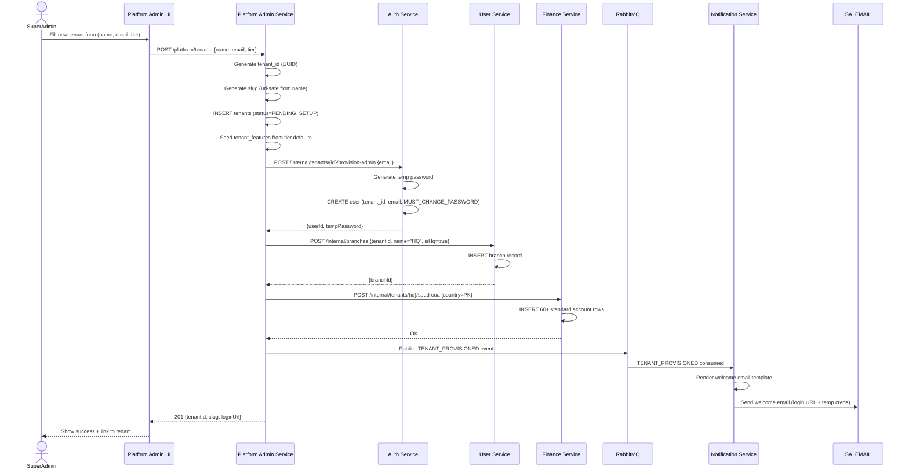

---

# FD-2. Authentication & Token Flow

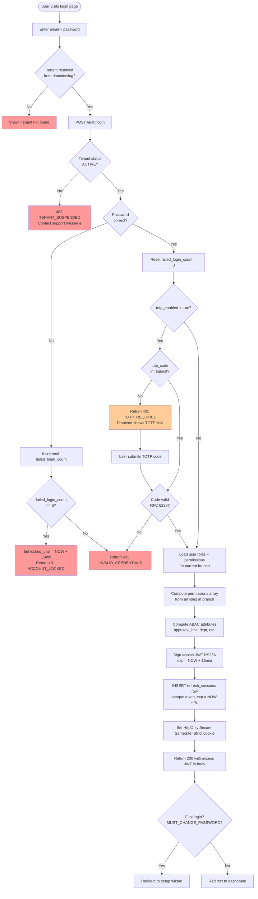

---

# FD-3. POS Order Lifecycle — State Machine

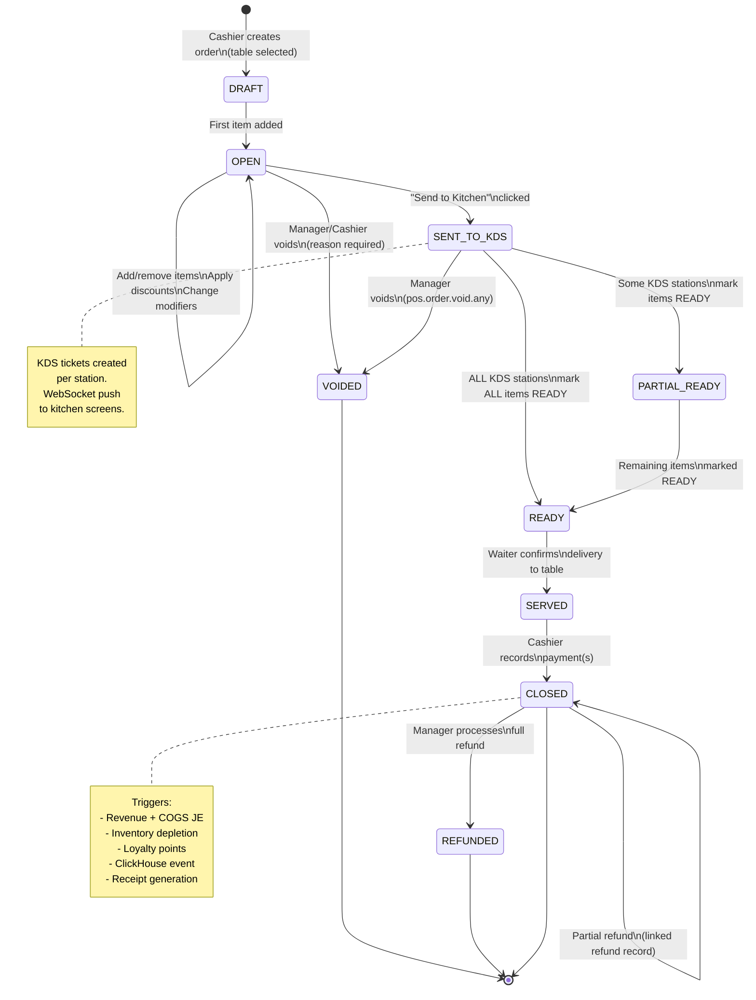

---

# FD-4. Order Close — Event Fan-Out Flow

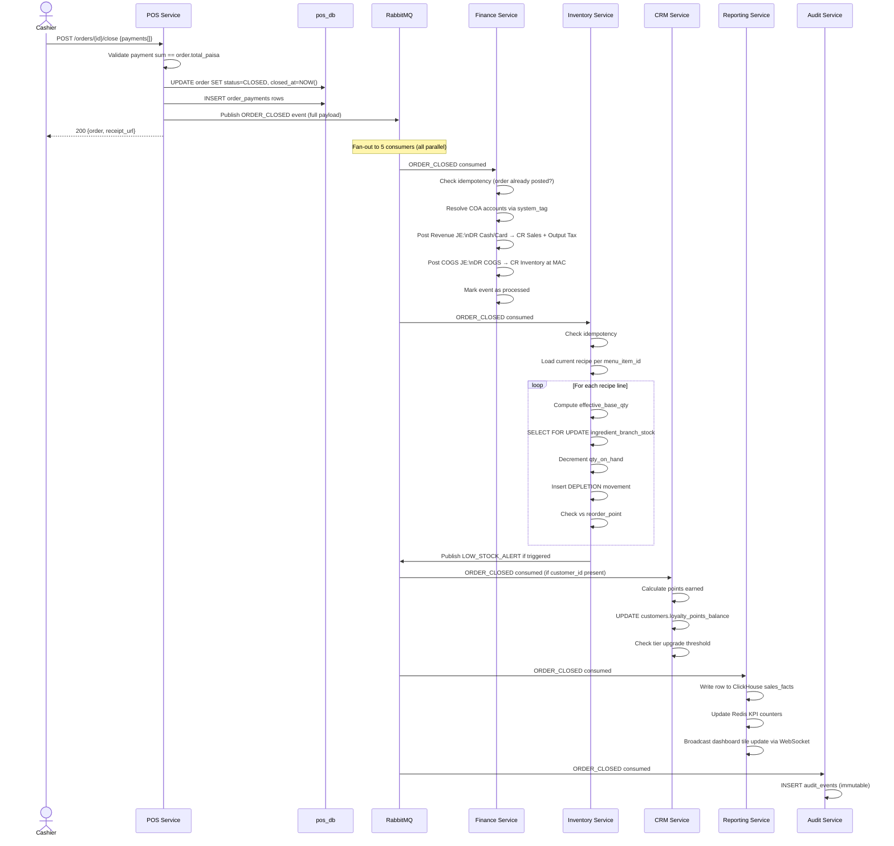

---

# FD-5. Offline POS Sync Flow

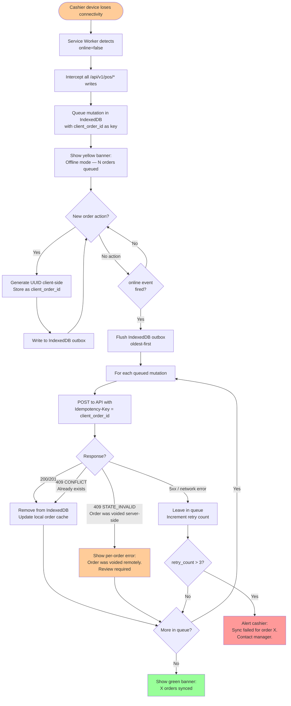

---

# FD-6. Inventory Depletion Sequence

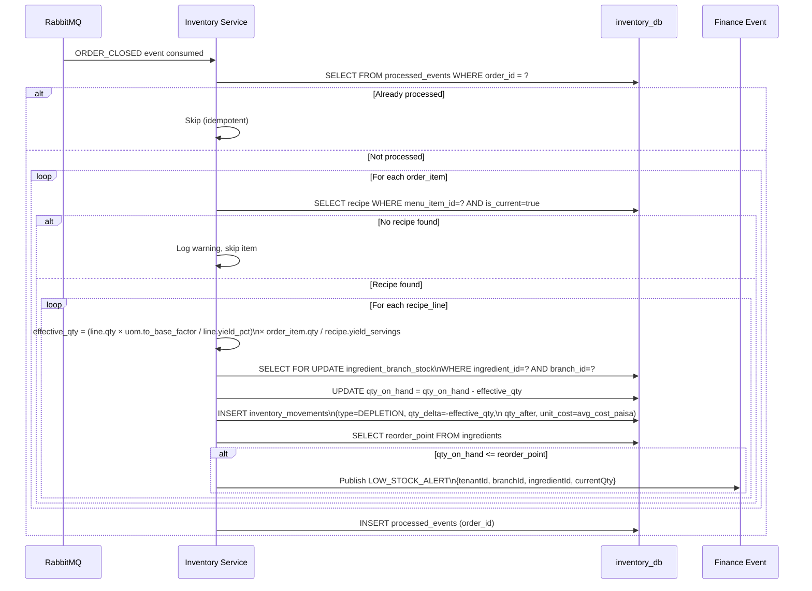

---

# FD-7. Moving Average Cost Update Flow

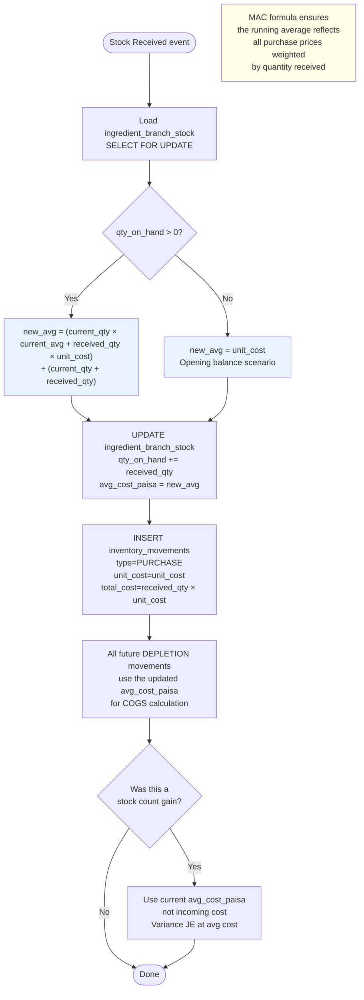

---

# FD-8. Purchase Order & Three-Way Match Flow

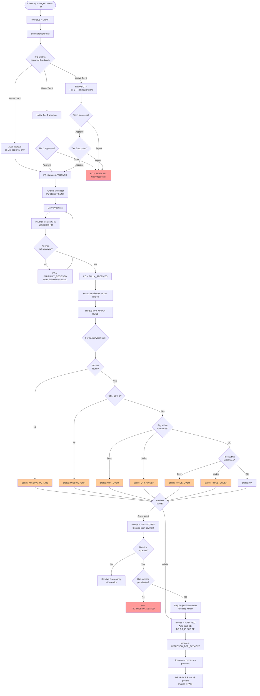

---

# FD-9. Financial Auto-Posting Decision Tree

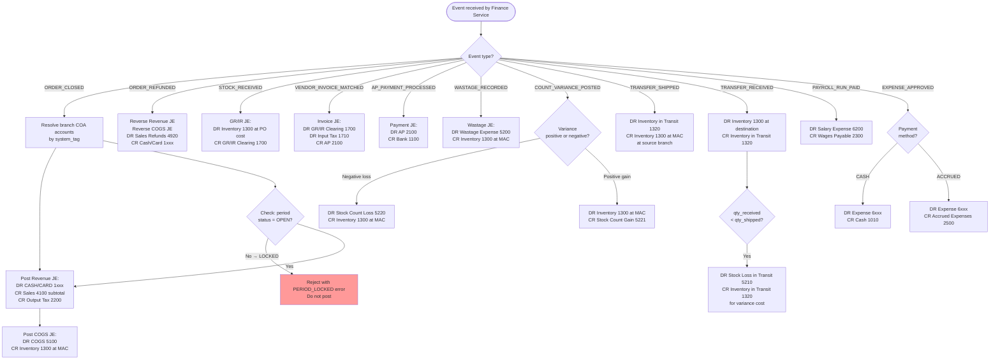

---

# FD-10. NLQ Pipeline Flow

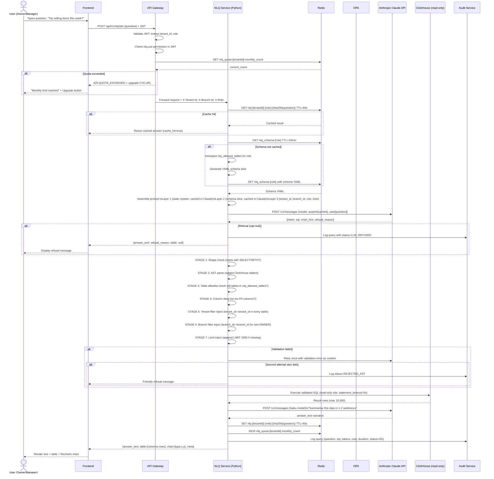

---

# FD-11. KDS Order Routing Flow

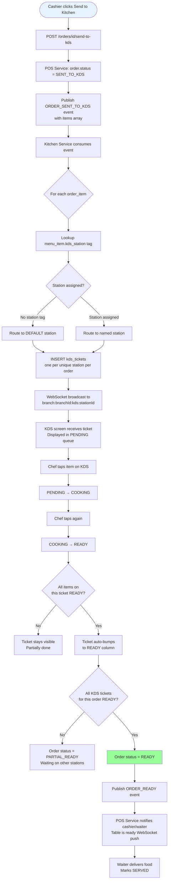

---

# FD-12. Inter-Branch Stock Transfer Flow

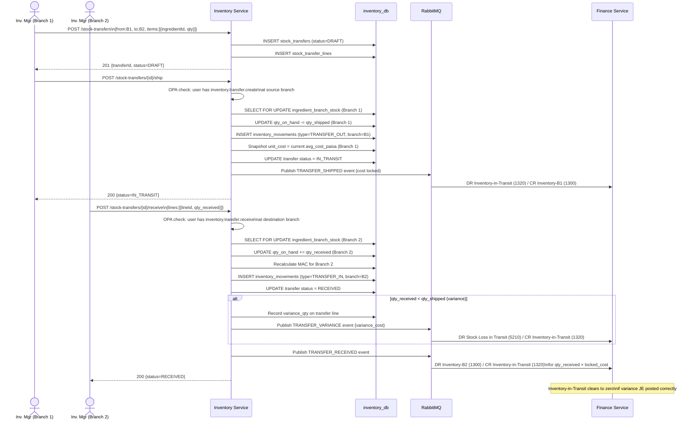

---

# FD-13. Payroll Run Flow

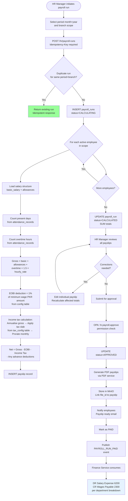

---

# FD-14. Period Close Flow

```mermaid
flowchart TD
    A([Accountant initiates period close]) --> B[POST /finance/periods/{id}/close]
    B --> C[OPA: finance.period.close permission]

    C --> D[PRE-CLOSE CHECK 1:\nAny orders OPEN or SENT_TO_KDS\nolder than 12 hours?]
    D -- Yes --> E[BLOCKED: List open orders\nwith links to resolve]
    D -- No --> F[PRE-CLOSE CHECK 2:\nAny POs in PARTIALLY_RECEIVED\nwith no vendor invoice?]
    F -- Yes --> G[BLOCKED: List blocking POs]
    F -- No --> H[PRE-CLOSE CHECK 3:\nAny vendor invoices\nPENDING_MATCH > 48h?]
    H -- Yes --> I[BLOCKED: List pending invoices]
    H -- No --> J[PRE-CLOSE CHECK 4:\nAll bank reconciliations\nfor this period COMPLETE?]
    J -- No --> K[BLOCKED: List incomplete\nreconciliations]
    J -- Yes --> L[ALL CHECKS PASSED]

    L --> M[Show confirmation dialog:\nPeriod summary\nTotal debits, credits, net income\nAre you sure?]
    M --> N{Confirmed?}
    N -- No --> O[Cancel - no change]
    N -- Yes --> P[UPDATE accounting_periods\nstatus=LOCKED\nlocked_by=user_id\nlocked_at=NOW]

    P --> Q[Publish PERIOD_CLOSED event]
    Q --> R[Reporting Service:\nSnapshot P&L to ClickHouse]
    Q --> S[Audit Service:\nLog period close]
    Q --> T[Notification Service:\nNotify ACCOUNTANT + OWNER]

    P --> U[All subsequent JE attempts\nfor this period return:\n423 PERIOD_LOCKED]

    style E fill:#ff9999
    style G fill:#ff9999
    style I fill:#ff9999
    style K fill:#ff9999
    style L fill:#99ff99
```

---

# FD-15. Feature Flag & Quota Enforcement Flow

```mermaid
flowchart TD
    A([API request arrives at Gateway]) --> B[Gateway: Validate JWT signature]
    B --> C{JWT valid?}
    C -- No --> D[401 UNAUTHENTICATED]
    C -- Yes --> E[Extract tenant_id from JWT]

    E --> F[GET tenant status from Redis\nKey: tenant:status:{tenantId}]
    F --> G{Status?}
    G -- SUSPENDED --> H[403 TENANT_SUSPENDED\nContact support message]
    G -- CANCELLED --> H
    G -- ACTIVE --> I[Determine target service\nfrom request path]

    I --> J[Extract feature_code\nfor this route\ne.g. /hr/* → FEATURE_HR]
    J --> K{feature_code\napplicable?}
    K -- No feature gate --> L[Proceed to service]
    K -- Yes → check flag --> M[GET from Redis:\ntenant_features:{tenantId}:{featureCode}]

    M --> N{Feature\nenabled?}
    N -- No --> O[403 FEATURE_DISABLED\nX-Upgrade-CTA-URL header set]
    N -- Yes --> P[Check quota if applicable\ne.g. NLQ queries, branch count]

    P --> Q{Quota resource\napplicable?}
    Q -- No --> L
    Q -- Yes --> R[GET Redis:\nnlq_quota:{tenantId}:monthly_count]

    R --> S{count >=\nmax_quota?}
    S -- Yes --> T[429 QUOTA_EXCEEDED\nX-Quota-Resource: NLQ_QUERY]
    S -- No --> U{count >=\n80% of max?}
    U -- Yes --> V[Add X-Quota-Warning: 80% header\nContinue to service]
    U -- No --> L

    V --> L
    L --> W[Route to upstream service\nPropagate X-Tenant-Id header]

    style D fill:#ff9999
    style H fill:#ff9999
    style O fill:#ffcc99
    style T fill:#ff9999
```

---

# FD-16. White-Label Domain Provisioning Flow

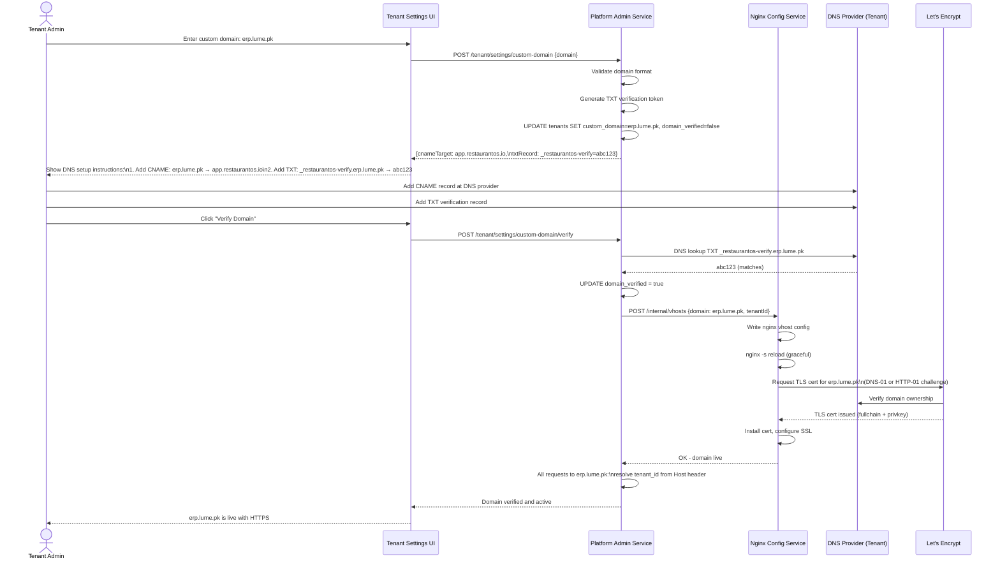

---

# FD-17. OPA Authorization Decision Flow

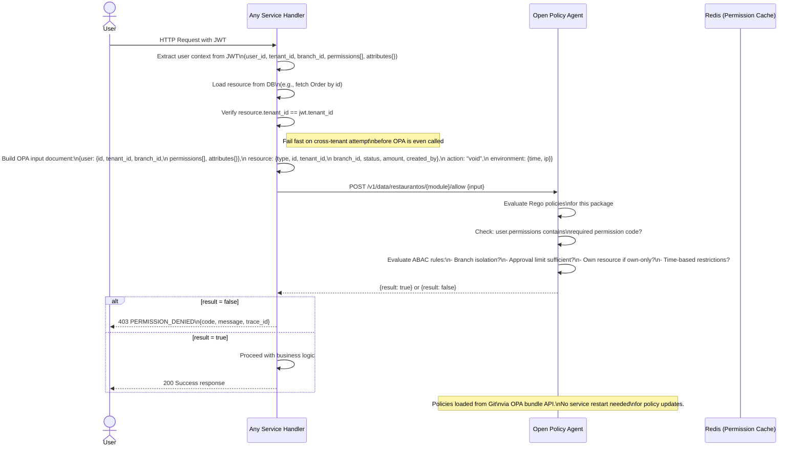

---

# FD-18. Frontend Request Lifecycle Flow

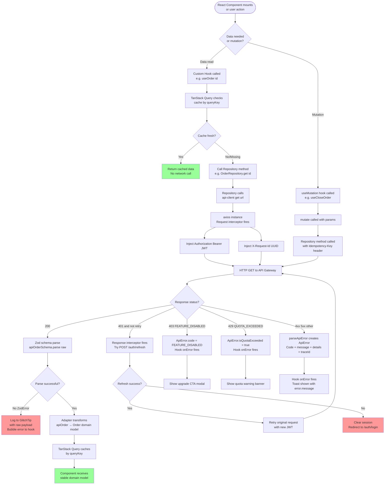

---

# FD-19. RabbitMQ Event Backbone Flow

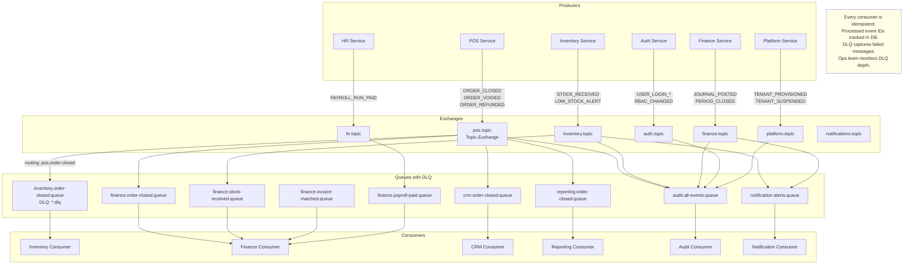

---

# FD-20. Notification Dispatch Flow

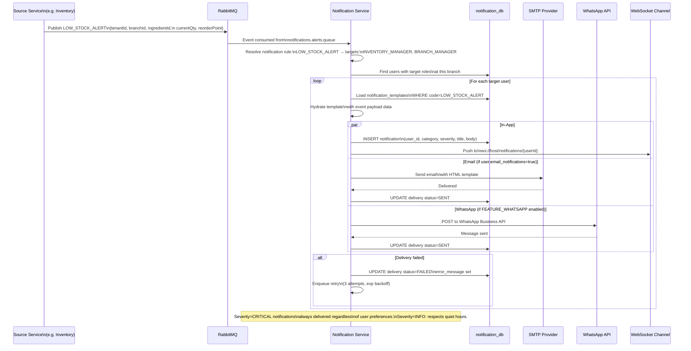

---


---

# Business Logic Rules Reference

> This section documents explicit business rules that are not obvious from the flows. An AI coding agent must implement these exactly as written.

## BLR-1. Money & Rounding

| Rule | Implementation |
|---|---|
| All money stored as `BIGINT` paisa (1 PKR = 100 paisa) | Never use DECIMAL or FLOAT for money. Java: `BigInteger` or `long`. TypeScript: `number` (safe up to 2^53, sufficient for PKR amounts at this scale). |
| Tax calculation | Per line: `floor((unit_price_paisa - discount_paisa_per_unit) * quantity * tax_rate_pct / 100)`. Half-up rounding. Never apply tax to the order total directly. |
| Split bill — remainder | When splitting equally: `total_paisa % n` paisa added to the first share. Do not distribute remainder across all shares. |
| MAC update | `new_avg = floor((current_qty * current_avg + incoming_qty * incoming_unit_cost) / (current_qty + incoming_qty))`. Integer arithmetic. |
| Display only | `pkr = paisa / 100.0`. Formatted via `Intl.NumberFormat`. Never stored as PKR. |

## BLR-2. Tenant Isolation

| Rule | Implementation |
|---|---|
| Every DB query filters by `tenant_id` | Hibernate filter `tenantFilter` is active for every `EntityManager` request. Cannot be bypassed. |
| Every DB table has `tenant_id` column | Enforced by `TenantAuditableEntity` base class. Any entity without it fails the CI unit test that scans all entity classes. |
| `tenant_id` is never accepted from the client | Spring AOP aspect on all controllers strips any client-provided `tenant_id` and replaces with JWT value. |
| Cross-tenant API call | Detect when `resource.tenant_id != jwt.tenant_id`. Return 404 (not 403 — do not reveal the resource exists). |
| RLS session variable | Set `app.current_tenant_id` at JDBC connection open via `SET LOCAL`. Cleared automatically at connection return to pool. |

## BLR-3. Inventory Depletion

| Rule | Implementation |
|---|---|
| Effective base qty formula | `(recipe_line.quantity * uom.to_base_factor / recipe_line.yield_pct) * order_item.quantity / recipe.yield_servings` |
| Missing recipe | Do not fail the order. Log a `WARN` entry. Skip depletion for that item. |
| Negative stock allowed | Do NOT block depletion if stock would go negative. Alert only. This prevents POS from freezing during a busy service when counts are stale. |
| Idempotency | Track `processed_order_ids` table in `inventory_db`. If order_id already in this table, skip all depletion. |
| Locking | `SELECT ... FOR UPDATE` on `ingredient_branch_stock` per ingredient before updating. Prevents race conditions with concurrent order closes. |

## BLR-4. Double-Entry Bookkeeping

| Rule | Implementation |
|---|---|
| Every JE must balance | Enforce via DB trigger `check_je_balance()`. A JE that is posted but doesn't balance must NEVER exist. The trigger fires `AFTER INSERT` on `journal_entries` and counts `journal_lines`. |
| JEs are immutable | No `UPDATE` or `DELETE` on `journal_entries` or `journal_lines`. Corrections = reversal JE. |
| Source event deduplication | Each auto-posting recipe checks `SELECT 1 FROM posted_source_events WHERE source_type=? AND source_id=?` before posting. Idempotent. |
| Period status check | Before inserting any JE: `SELECT status FROM accounting_periods WHERE tenant_id=? AND period covers entry_date`. If `LOCKED` or `CLOSED`: raise `PERIOD_LOCKED` exception. |
| COGS at MAC | When posting COGS on order close: use `ingredient_branch_stock.avg_cost_paisa` at the moment of close, not a historical price. If MAC = 0 (no stock was ever received): COGS is zero and a warning is logged. |

## BLR-5. OPA Policy Rules

| Rule | Implementation |
|---|---|
| Branch isolation is non-negotiable | Every Rego policy begins with `input.resource.branch_id == input.user.branch_id` and `input.resource.tenant_id == input.user.tenant_id`. No exceptions. |
| Own-order void | `resource.created_by == user.id AND resource.status == "OPEN"` for cashier. Closed orders cannot be voided — only refunded. |
| Expense approval | `resource.amount_paisa <= user.attributes.approval_limit_paisa`. If over limit: 403 with message "Amount exceeds your approval limit of PKR X". |
| OPA input must include resource attributes | Service fetches the resource BEFORE calling OPA and includes its attributes. OPA is never called with an empty or partial resource. |
| OPA failure = deny | If OPA returns a non-200 or times out: deny the request with 500. Never default to allow. |

## BLR-6. NLQ Safety Rules

| Rule | Implementation |
|---|---|
| Only SELECT allowed | Regex check + AST check. Both must pass. Fail open = security breach. |
| tenant_id filter mandatory | Validator auto-injects if missing. Never trusts Claude to include it. |
| PII column block | Deny list: `email`, `phone`, `cnic`, `bank_account_no`, `password_hash`, `totp_secret`. Any query referencing these is rejected even if the table is allowed. |
| Max rows | 10,000 hard cap. Result truncated with a `truncated=true` flag in response. |
| Statement timeout | ClickHouse query timeout set to 5 seconds at connection level. |
| Cost tracking | After every Claude call: `input_tokens` and `output_tokens` from the API response are stored in `nlq_query_log.prompt_tokens` and `output_tokens`. Estimated cost = `(input_tokens * input_rate + output_tokens * output_rate)` in USD, converted to paisa at configured exchange rate. |

## BLR-7. Feature Flags

| Rule | Implementation |
|---|---|
| Gateway-level block | API Gateway checks feature flag before routing. Service-level check is a second layer, not a replacement. |
| Cache TTL | 5 minutes in Redis. On SuperAdmin flag change: `DEL tenant_features:{tenantId}:*` immediately. |
| Response on disabled | 403 with `code: FEATURE_DISABLED`, `message: "This feature is not available on your current plan"`, and `X-Upgrade-CTA-URL: /billing/upgrade` header. |
| UI layer | Front-end reads JWT `permissions[]` and feature flags (fetched once at login, cached in Zustand). Feature-gated routes redirect to an "Upgrade" page. Feature-gated UI elements are hidden, not disabled. |

## BLR-8. Audit Immutability

| Rule | Implementation |
|---|---|
| Append-only audit table | App DB user has only `INSERT` privilege on `audit_events`. A Postgres trigger raises `RAISE EXCEPTION` on any `UPDATE` or `DELETE`. |
| Impersonation stamp | When `impersonated_by` is present in the JWT: every audit event includes `impersonated_by_user_id`. Queries executed during impersonation are distinguishable in audit history. |
| Audit on failure too | Failed authorisation attempts (OPA deny) are also audited: `action: ACCESS_DENIED`, `before: null`, `after: null`. |

## BLR-9. Offline POS

| Rule | Implementation |
|---|---|
| Idempotency key = client_order_id | The `client_order_id` UUID is generated client-side for each order and sent as the `Idempotency-Key` header on the create request. |
| Server dedup | `orders.client_order_id` is a `UNIQUE` constraint. Duplicate insert → DB constraint error → service returns the existing order (same as idempotent response). |
| Flush order | Oldest-first (sort by `enqueuedAt` ascending). This preserves causality: create-order before close-order. |
| Menu cache | Service Worker caches the menu API response for up to 30 minutes. Price/availability changes made while offline may differ from what was served offline — this is accepted behaviour. Prices at close use the snapshot stored in `order_items.unit_price_snapshot`. |

## BLR-10. Period & Fiscal Year

| Rule | Implementation |
|---|---|
| Pakistan fiscal year | Starts July 1, ends June 30. Period 1 = July, Period 12 = June. `fiscal_year` is the year the period **starts** (e.g., FY2026 = Jul 2026 – Jun 2027). |
| Business day | An order's business date = `DATE(opened_at AT TIME ZONE branch.timezone - INTERVAL '{offset} hours')` where `offset` = branch-configured cutoff (default 4). |
| Period seeding | On tenant provisioning, 12 accounting periods are created for the current fiscal year (OPEN). Next fiscal year's periods are seeded 30 days before the current year's Period 12 close. |
| Period reopen | Requires `finance.period.reopen` (OWNER only). Logs a mandatory reason. Triggers an audit event. Changes status from LOCKED → OPEN. A re-closed period creates a second PERIOD_CLOSED event. |

---

# Agent Implementation Checklist

Use this checklist to verify each service is complete before marking it done.

## Per-Service Checklist

- [ ] `@FilterDef` and `@Filter` annotations on every entity class in the service.
- [ ] `TenantFilterInterceptor` registered and active for all HTTP handlers.
- [ ] PostgreSQL RLS policy on every tenant-scoped table.
- [ ] DB migrations via Liquibase. Startup fails if migration fails.
- [ ] All money fields are `BIGINT` paisa. No `DECIMAL` for money.
- [ ] All timestamps are `TIMESTAMPTZ`. No `TIMESTAMP WITHOUT TIME ZONE`.
- [ ] `TenantAuditableEntity` base class used for every entity.
- [ ] `Idempotency-Key` header accepted and checked on all mutating endpoints.
- [ ] `version` field on editable entities. `If-Match` header on update endpoints.
- [ ] OPA called before every state-mutating operation.
- [ ] `@RequiresFeature` annotation on every endpoint that is feature-gated.
- [ ] RabbitMQ consumer is idempotent (checks `processed_event_ids`).
- [ ] Dead-letter queue configured for every consumer queue.
- [ ] All events published include `tenantId`, `eventId`, `occurredAt`, `correlationId`.
- [ ] Audit event published for every significant action.
- [ ] SpringDoc `@Operation` and `@ApiResponse` annotations on all controller methods.
- [ ] Integration tests: happy path + 403 + 400 for every endpoint.

## Frontend Per-Feature Checklist

- [ ] Zod schema in `lib/api-client/schemas/{domain}.schema.ts`.
- [ ] Adapter in `lib/adapters/{domain}.adapter.ts`.
- [ ] Domain model in `lib/models/{domain}.model.ts`.
- [ ] Repository in `lib/repositories/{domain}.repository.ts`.
- [ ] Query hooks in `lib/hooks/{domain}/use-{operation}.ts`.
- [ ] Query keys registered in `lib/hooks/query-keys.ts`.
- [ ] MSW handler for API mock in `__mocks__/handlers/{domain}.ts`.
- [ ] MSW contract test in `__tests__/hooks/{domain}/`.
- [ ] Component uses hook only — no direct import of repository or API client.
- [ ] Feature flag guard on route (`/hr/*` renders `<FeatureGuard feature="FEATURE_HR">`).
- [ ] Permission guard on UI elements (`usePermission('pos.order.void.any')`).
- [ ] Loading skeleton shown while data is fetching.
- [ ] Error state handled with toast + retry option.
- [ ] Empty state shown when data is loaded but list is empty.

---

